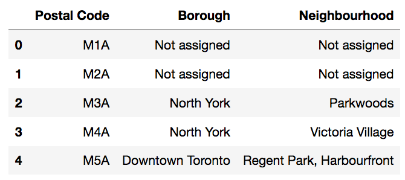
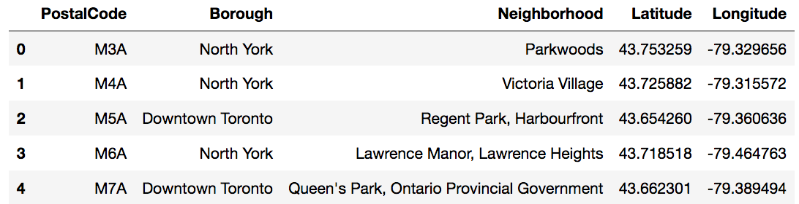
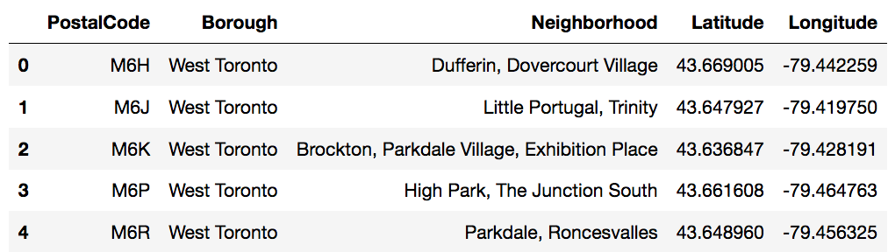
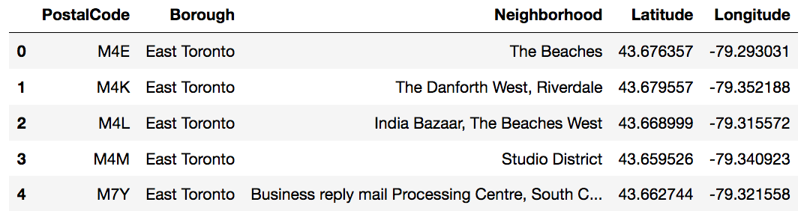

# Analyzing-Toronto-Neighborhoods
## by Sushant Deshpande

Every city is built on different circumstances, environment and different constraints. In this project, we’ll compare the neighborhoods of of 2 major columns and how can they be compared with respect to places to eat, better connectivity to several useful regions and how are they distributed around both cities. The places I will be considering are airports, metro, coffee shop, restaurants, schools, college, general stores, hospitals etc. The audience will be tourists who consider travelling through financial capital of the 2 countries analyzed and search for better neighborhoods suited for their needs.

Every city is built on different circumstances, environment and different constraints. In this project, we’ll analyze Toronto’s most multicultural neighbourhoods, East Toronto and West Toronto. By doing so, we’ll see what types of venues are popular in each neighbourhoods. This will help a group of investors understand what type of restaurant they would like to invest in. In order to achieve this, We’ll perform the following:

 - Get the postal codes from Wikipedia using web scraping method in python.
 - Clean up the data and merge it with the geopositional data provided to us by Coursera.
 - Use FourSquare to get the venues in our desired neighbourhood.
 - Use python to find to 10 most popular venues and display it graphically.

### STEP 1 - Importing the data

We begin with grabbing the postal codes from Wikipedia’s webpage using python’s web scraping method.
Code for scraping looks like this:

    url = "https://en.wikipedia.org/wiki/List_of_postal_codes_of_Canada:_M"
    tables = pd.read_html(url)
    table_df = tables[0]
   

### STEP 2 - Cleaning the data

More than one neighbourhood can exist in one postal code area. For example, in the table on the Wikipedia page, you will notice
that M5A is listed twice and has two neighbourhoods: Harbourfront and Regent Park. These two rows will be combined into one
row with the neighbourhoods separated with a comma.

Now we need to combine our data with geospatial_coordinates.csv file provided to us. This’ll get us coordinates for each of the
postal codes. These coordinates will be used in the next step with FourSquare

### STEP 3 - FourSquare

First, we split the data in to 2 categories, East Toronto and West Toronto.

With FourSquare, we get the list of venues that are close to a selected postal code.

When we run the analysis for the whole of East and West Toronto, we can see that Four Square tells us that East Toronto has 133 unique categories and West Toronto has 162 unique categories.

We analyze each neighbourhood using one hot encoding. Next, we group rows by neighbourhood and by taking the mean of the frequency of occurrence of each category and print each neighbourhood along with the top 5 most common venues.

Now we cluster our neighbourhoods using k-means cluster algorithm.

As is clear from the data analysis, Cafes are the the most popular venues in West Toronto with 41 locations and in East Toronto,
there second most popular with 14 locations. It is clear that they are the new emerging trend. As an investor, it would be advisable to invest in a Cafe Shop in East Toronto. Since there are on 14 there compared to 41 in West Toronto, opening one up in East Toronto would be a wise move.